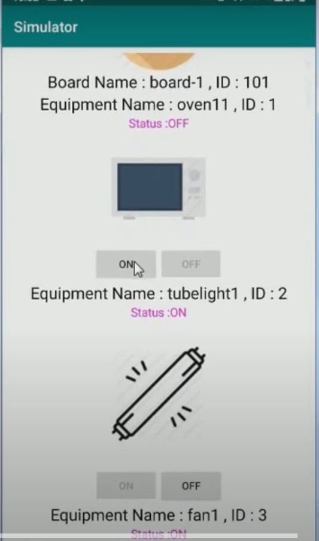

 
[](https://github.com/saksham2105/smarthome/commits/master)
[]()

## Overview
Smartify is a Home Automation Framework By which end users can controll and manage their Home appliances with the help of Native mobile applications.It provides various set of features which are mentioned below.

#### Clone

- Clone this repo to your local machine.

#### Run server locally

```shell
Start Tomcat Server and send request to a url(Check Demo Link)
```
> Go to localhost:8080/one.com/homeService?queryString [GET Request]

---

### Video Preview (Click on the images to see video preview)
[](https://www.youtube.com/watch?v=FAOR90fjsno)
[](https://www.youtube.com/watch?v=6ZmIYYKV3MM)

## Features 📋
* A User can edit the equipments Name from android app.
* Real time UI change of any Equipment will be broadcasted to every mobile phone who is connected to Network
* User can see their score on the leaderboard and Unlock and view any code challenge.
* User Friendly Mobile Application
* It uses No SQL Database
---
## Tools and Technologies Used 
     

## Screenshots
*Android App UI


Demo :
1. [Video1](https://youtu.be/FAOR90fjsno)
2. [Video2](https://youtu.be/6ZmIYYKV3MM)
